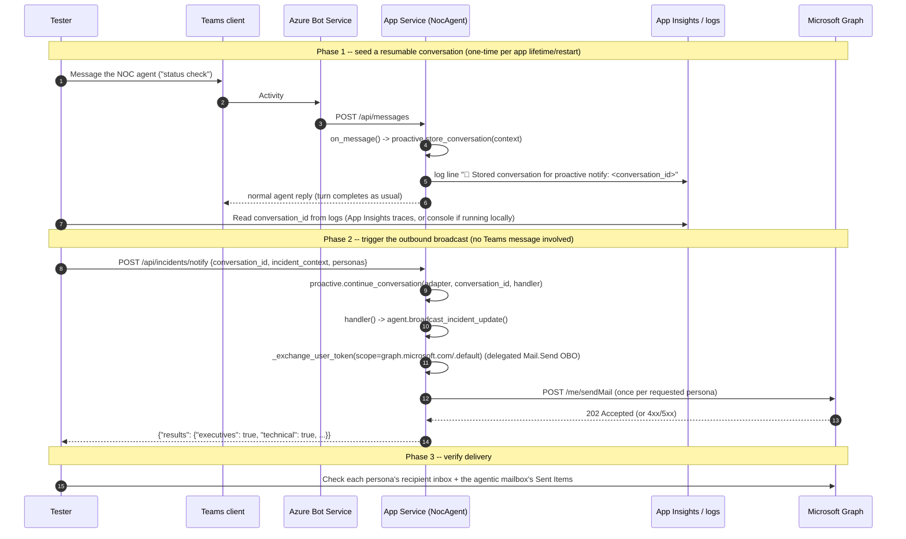

# Outbound Multi-Persona Incident Notifications

> Answers the Accenture review questions on agent-initiated outbound email.
> Code: `agent/notifications.py`, `agent.py`'s `broadcast_incident_update()`,
> `host_agent_server.py`'s `POST /api/incidents/notify`. Templates:
> `data/runbooks/customer_communication_template.md` §"Persona Templates".

## TL;DR

| Question | Answer |
|---|---|
| Existing A365 sample for agent-initiated multi-recipient email? | **No.** Neither `Agent365-Samples` nor `agent365-skills` demonstrate this. The closest Microsoft accelerator ("Work IQ" email trigger in `microsoft-iq-solution-accelerator`) is a **different product** — a Power Automate/Copilot Studio inbound trigger, not an A365/MAF outbound pattern. This repo's `notifications.py` is a from-scratch reference implementation. |
| Supported permission/auth model for outbound send? | Delegated `Mail.Send` on the same agentic user identity, granted via the **same `oauth2PermissionGrants` mechanism** already used for `Mail.Read` (docs/DEPLOYMENT.md step 6a/6b) — **no new app registration needed.** |
| Templating/persona routing guidance at the A365 layer? | **None — it's entirely application-side**, same as this repo's implementation. A365 has no persona/templating primitive of its own. |

## 1. Is there a Microsoft sample for this pattern?

No. Two things were checked and ruled out:

- **`Agent365-Samples` / `agent365-skills`** — no outbound-email-fan-out
  sample exists in either.
- **`microsoft-iq-solution-accelerator`'s "Work IQ" email trigger**
  (`docs/DeploymentGuide.md` → "Post-Deployment Steps — Work IQ") is a
  **Copilot Studio + Power Automate** pattern: an inbound-email Power
  Automate trigger invokes a Copilot Studio agent (itself calling Fabric
  IQ/Foundry IQ), published to the **Teams channel of Copilot Studio**, not
  A365. It is inbound-triggered, single-reply, not proactive, and not
  multi-persona — architecturally unrelated to this repo's Teams → Bot
  Service → App Service → MAF flow. It is **not** a template to copy from.

`agent/notifications.py` was written from scratch for this gap.

## 2. Can the existing Teams → Bot Channel → App Service flow originate a proactive send?

**Yes — this is the mechanism actually implemented, no Copilot Studio /
Power Automate needed.** The Microsoft 365 Agents SDK this repo already
depends on (`microsoft-agents-hosting-core`) ships a first-class
**proactive-messaging subsystem** (`AgentApplication.proactive`,
a `Proactive` instance) built exactly for "resume a conversation with no
new inbound user message":

```python
# On every inbound turn (host_agent_server.py's on_message handler):
await self.agent_app.proactive.store_conversation(context)   # persist conversation reference

# Later, from an external trigger with NO Teams message in flight:
await self.agent_app.proactive.continue_conversation(adapter, conversation_id, handler)
# -> re-enters a full turn (state loaded, context rebuilt) and runs `handler(context, state)`
```

This repo wires that into a new webhook:

```
Azure Monitor alert / Logic App / incident-management webhook
        │  POST /api/incidents/notify
        │  {conversation_id, lifecycle_stage/incident_context, personas: [...]}
        ▼
host_agent_server.py: notify_incident()
        │  self.agent_app.proactive.continue_conversation(adapter, conversation_id, handler)
        ▼
handler(context, state):  agent_instance.broadcast_incident_update(...)
        │  Graph OBO token exchange (same _exchange_user_token() as Fabric IQ/Work IQ,
        │  scoped https://graph.microsoft.com/.default, delegated Mail.Send)
        ▼
notifications.broadcast(): one Graph POST /me/sendMail per requested persona
```

**Why this bypasses the Toolbox (and that's correct, not a regression):**
Work IQ's Foundry connection is read-only (`Mail.Read` etc., see
`docs/ARCHITECTURE.md`); the Toolbox has no `sendMail` action to call. This
path calls Microsoft Graph directly over the *existing* OBO channel instead
of adding it as a 5th Toolbox connection — same trust boundary and same
token-exchange pattern the other 4 tools use, just a different destination
API. The single-Toolbox/4-IQ-tool architecture for the *conversational* turn
is unchanged.

**Prerequisite, mechanically:** a conversation must have been
`store_conversation`'d at least once (i.e., a Teams user — e.g. the on-call
NOC engineer — has messaged the bot at least once since the last app
restart) before `conversation_id` can be resumed. There is no channel-level
way to originate a *brand-new* conversation with a user who has never
interacted with the agent without also using `proactive.create_conversation`
(possible, but requires knowing the target user's AAD object ID up front —
not wired here; see Limitations).

## 3. What's the permission/auth model for the agentic identity to send mail?

Confirmed, not assumed: the agentic user identity (`nocagent@<tenant>`,
created by `a365 setup all`) is a **real, licensed M365 mailbox** — the same
kind of principal Work IQ's `Mail.Read` already reads from. Delegated
`Mail.Send` needs **exactly the same `oauth2PermissionGrants` treatment**
already applied for `Mail.Read`/Fabric IQ/Work IQ (see
`docs/TROUBLESHOOTING.md`'s consent-gap entries and `docs/DEPLOYMENT.md`
step 6a) — just add `Mail.Send` to the same Graph SP's granted `scope`
string (step 6b). **No separate app registration, no client-credential
grant, no Application-permission consent is needed** — it rides the same
agentic-identity OBO path as everything else in this app.

This only works because sends happen **inside a turn** (a resumed
`continue_conversation` turn counts as a turn) — the OBO exchange requires a
`TurnContext`. If a future requirement needs mail to originate with **no
conversation ever having existed** (true zero-touch, e.g., day-one
onboarding before any Teams interaction), that's a materially different
permission model: `Mail.Send` as an **Application permission** on a
separate client-credential app registration, sending "as" the mailbox via
app-only grant — not the agentic-identity OBO pattern used elsewhere in this
repo. Flagging this distinction now so it isn't assumed away later.

## 4. Templating / persona routing — application-side, not A365

A365/the Agents SDK has no templating or audience-routing primitive. This
repo's answer is deliberately minimal (see `agent/notifications.py`):

- **Templates**: one `### Persona: <name>` markdown section per audience in
  `data/runbooks/customer_communication_template.md`, using the SAME
  single-brace `{Variable}` convention as the pre-existing customer-facing
  templates (no new syntax introduced).
- **Recipients**: one `NOTIFY_<PERSONA>_EMAILS` env var per audience — a
  static comma-separated allow-list, not a stakeholder directory.
- **Field restriction**: each persona has an explicit `allowed_fields` set;
  `render_persona_message()` only exposes those fields to that persona's
  template, so (e.g.) the `partners` audience structurally cannot see
  internal root-cause telemetry even if `incident_context` includes it.

## End-to-end test procedure



### Prerequisites (do once, before any test run)

1. Deploy the base repo per `docs/DEPLOYMENT.md` (App Service running, `AUTH_HANDLER_NAME` set, `a365 setup all` completed).
2. Grant the **`Mail.Send`** consent from `docs/DEPLOYMENT.md` step 6b (in addition to step 6a's `Mail.Read`).
3. Set at least one `NOTIFY_<PERSONA>_EMAILS` env var (e.g. `NOTIFY_TECHNICAL_EMAILS=you@yourtenant.com`) on the App Service and restart it -- personas with no recipients are silently skipped (by design, not a bug).
4. Confirm the agentic identity's mailbox (`nocagent@<tenant>`) is licensed for Exchange Online (a Copilot/M365 license alone does not guarantee a mailbox -- `Mail.Send` will 403 without one).

### Step-by-step

1. **Seed a conversation.** In Teams, message the agent once (any text, e.g. `"status check"`). Confirm a normal reply comes back -- this proves the turn completed and `store_conversation` ran.
2. **Retrieve the `conversation_id`.** Search App Insights `traces` (or stdout if running via `azd deploy`/local `python host_agent_server.py`) for `"Stored conversation for proactive notify:"` and copy the ID that follows.
3. **Call the webhook** (from your own machine, `az rest`/`curl`/Postman -- must pass whatever JWT `/api/messages` already requires, since it shares middleware):
   ```bash
   curl -X POST https://<app-name>.azurewebsites.net/api/incidents/notify \
     -H "Content-Type: application/json" \
     -H "Authorization: Bearer <token>" \
     -d '{
       "conversation_id": "<id from step 2>",
       "personas": ["technical"],
       "incident_context": {
         "LifecycleStage": "escalation",
         "ServiceName": "Sydney-Melbourne Fibre",
         "IncidentId": "INC-TEST-001",
         "RootCauseSummary": "Test run -- physical fibre cut simulated",
         "TelemetrySummary": "n/a (test)",
         "ActionSummary": "Rerouting via backup path",
         "RunbookReference": "fibre_cut_runbook.md"
       }
     }'
   ```
4. **Check the response.** Expect `200 {"results": {"technical": true}}`. A `false` for a persona means either no recipients configured (check step 3 of Prerequisites) or a Graph error (check App Insights for the `"❌ Graph sendMail failed"` log line and its status code/body).
5. **Verify delivery.** Check the `NOTIFY_TECHNICAL_EMAILS` recipient's inbox for the email, and the agentic mailbox's **Sent Items** (since `saveToSentItems: true`).
6. **Repeat for the other 3 personas** (`executives`, `venue`, `partners`), and once with `"personas"` omitted entirely to confirm all 4 fire in one call.
7. **Negative-path checks** (confirm these fail cleanly, not silently):
   - Omit `conversation_id` -> expect `400`.
   - Use a `conversation_id` from before the app last restarted -> expect `404` (proves the in-memory-storage limitation above is real, not theoretical).
   - Revoke/skip the `Mail.Send` consent grant and re-test -> expect a Graph `403`/`invalid_grant` surfaced in the `results` as `false`, with detail in the logs (not a silent success).

### What "working end to end" means here

All four personas return `true` in Step 6, each recipient receives an email
matching their persona's template/field-restriction (§4 above), and the
`conversation_id`-expiry and consent-revocation negative paths in Step 7
fail the way this doc says they should. If any of that diverges, it's a
real bug in this reference implementation, not a documentation gap --
file it against `agent/notifications.py` or `host_agent_server.py`.

## Limitations (PoC-honest, read before Accenture builds further)

- **In-memory conversation storage.** `ProactiveOptions(storage=self.storage)`
  reuses the same `MemoryStorage()` as the rest of this PoC — every stored
  conversation reference (and therefore every valid `conversation_id`) is
  lost on app restart/redeploy. Swap in durable `Storage` (Cosmos/Blob-backed)
  before this is anything but a demo.
- **No stakeholder directory.** Recipients are static env vars, not sourced
  from Fabric IQ's Service/Stakeholder ontology entities (which already
  model this data) — see the `ponytail:` comment in `notifications.py`.
  Wiring that up is the natural next step, not done here to keep this
  change bounded and testable without a live Fabric workspace.
- **One template per persona, not per lifecycle stage.** `LifecycleStage`
  is passed as a plain string value into the existing template, not four
  separate stage-specific templates per persona (12 templates) — deliberate
  scope control, not an oversight.
- **No new-user proactive onboarding.** `proactive.create_conversation` (for
  messaging a user who has never talked to the bot) is not wired in; only
  `continue_conversation` against an already-stored conversation is.
- **No retry/dedup/delivery-tracking** on the Graph `sendMail` calls — a
  single 202 checked per persona, nothing more.
- **`notify_incident`'s only auth is the existing JWT middleware** shared
  with `/api/messages` — no additional authorization on which caller may
  target which `conversation_id`. Add one before exposing this beyond a
  single trusted internal caller (e.g. Azure Monitor action group).

None of this has been tested against a live tenant in this session (the
demo resource group was already torn down) — it is unit-tested at the
templating/parsing layer only (`python agent/notifications.py`). Validate
the Graph `sendMail` call and the `Mail.Send` consent grant end-to-end
against a real tenant before relying on this path.
