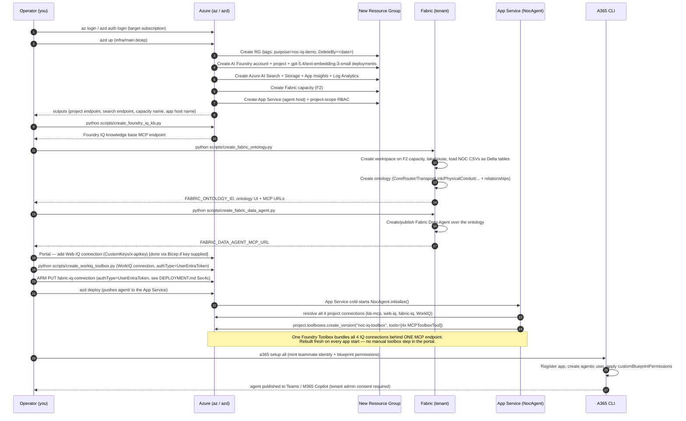
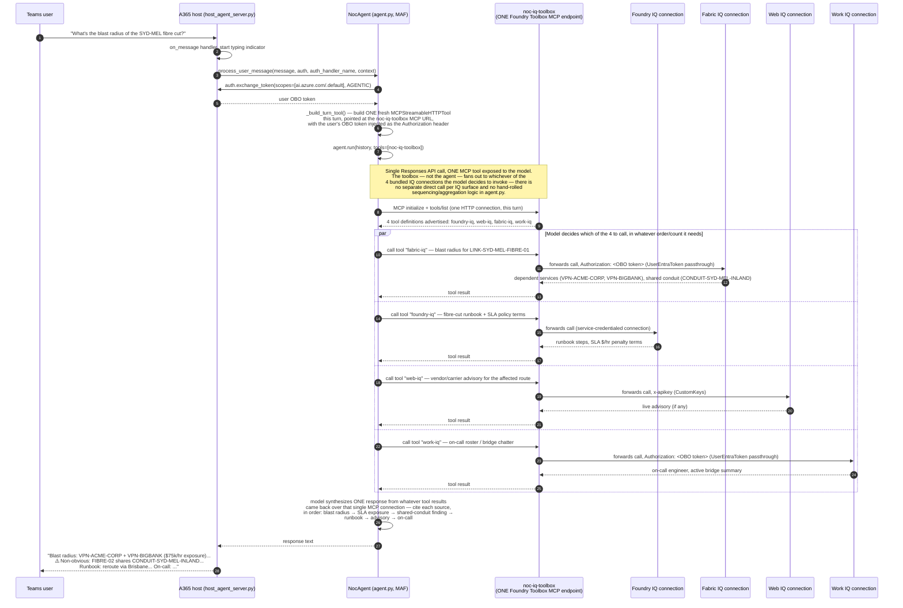

# Sequence Diagrams

## 1. End-to-end deployment sequence

## 2. Runtime turn — Teams user asks about the Sydney fibre cut

**Key point this diagram must make clear**: there is exactly **one** MCP tool
attached to the agent per turn (`noc-iq-toolbox`), and exactly **one**
`agent.run()` model call. The 4 IQ surfaces are connections *behind* that one
Toolbox, not 4 separate tools the agent code calls in sequence — the `par`
block above shows the model's own tool-selection deciding which (and how
many) of the 4 to invoke through that single MCP channel; nothing in
`agent.py` iterates over the 4 tools or aggregates their results itself.

## 3. The 5 narrative beats this sequence must produce

A correct end-to-end run must surface all five, each traceable to a real
tool call (verified via App Insights traces in the `verify-e2e` step, not
asserted from the model's unaided knowledge):

1. **Blast radius** — `VPN-ACME-CORP` + `VPN-BIGBANK` depend on the cut link
   (Fabric IQ).
2. **SLA exposure** — `$75,000/hr` = ACME (GOLD, `$50k/hr`) + BigBank (SILVER,
   `$25k/hr`) (Foundry IQ — SLA policy docs / Fabric IQ — SLA policy entity).
3. **Bounded exclusion** — `OzMine` (GOLD, `$40k/hr`) is **not** affected;
   the blast radius must be shown as bounded, not maximal (Fabric IQ).
4. **Non-obvious finding** — `LINK-SYD-MEL-FIBRE-02` (the "backup") shares
   `CONDUIT-SYD-MEL-INLAND` with the cut primary link — fake redundancy
   (Fabric IQ `RIDES_ON` relationship).
5. **Reroute** — the runbook-prescribed mitigation is a reroute via Brisbane
   (Foundry IQ knowledge base).
