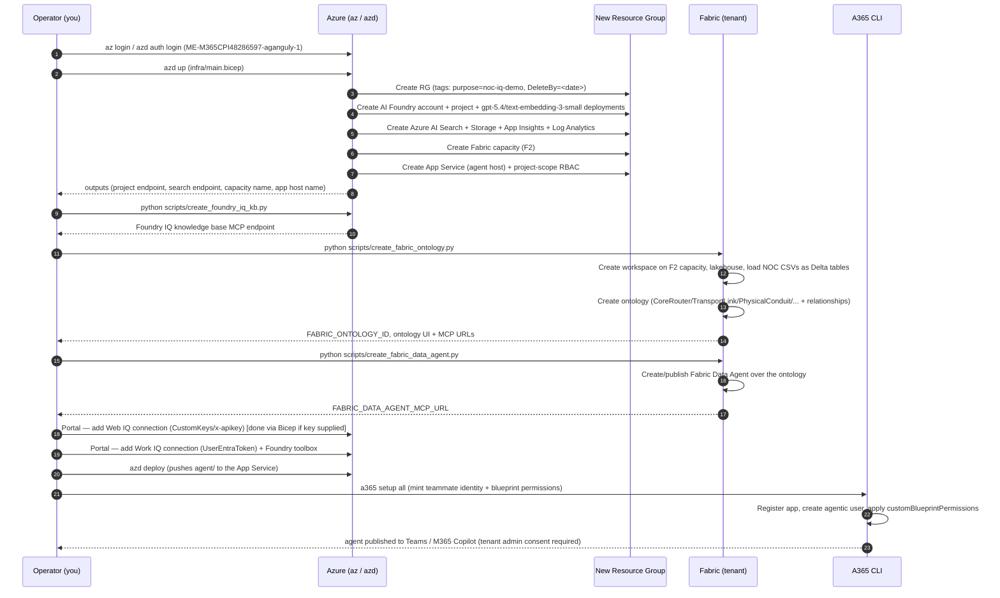

# Sequence Diagrams

## 1. End-to-end deployment sequence



## 2. Runtime turn — Teams user asks about the Sydney fibre cut

```mermaid
sequenceDiagram
    autonumber
    participant User as Teams user
    participant A365 as A365 host (host_agent_server.py)
    participant Agent as NocAgent (agent.py, MAF)
    participant FIQ as Foundry IQ (KB MCP)
    participant FabIQ as Fabric IQ (Data Agent MCP)
    participant WebIQ as Web IQ (web MCP)
    participant WorkIQ as Work IQ (FoundryToolbox)

    User->>A365: "What's the blast radius of the SYD-MEL fibre cut?"
    A365->>A365: on_message handler; start typing indicator
    A365->>Agent: process_user_message(message, auth, auth_handler_name, context)
    Agent->>A365: auth.exchange_token(scopes=[ai.azure.com/.default], AGENTIC)
    A365-->>Agent: user OBO token
    Agent->>Agent: build per-turn Fabric IQ + Work IQ tools from OBO token

    Agent->>Agent: agent.run(history, tools=[fabric_iq, work_iq_toolbox])
    Note over Agent: default tools (Foundry IQ, Web IQ) always available;<br/>per-turn tools merged for this call only

    Agent->>FabIQ: network-ontology tool call — blast radius for LINK-SYD-MEL-FIBRE-01
    FabIQ-->>Agent: dependent services (VPN-ACME-CORP, VPN-BIGBANK), shared conduit (CONDUIT-SYD-MEL-INLAND)
    Agent->>FIQ: knowledge-base tool call — fibre-cut runbook + SLA policy terms
    FIQ-->>Agent: runbook steps, SLA $/hr penalty terms
    Agent->>WebIQ: web-search tool call — vendor/carrier advisory for the affected route
    WebIQ-->>Agent: live advisory (if any)
    Agent->>WorkIQ: Microsoft 365 tool call — on-call roster / bridge chatter
    WorkIQ-->>Agent: on-call engineer, active bridge summary

    Agent->>Agent: synthesize response — cite each source, in order:<br/>blast radius → SLA exposure → shared-conduit finding → runbook → advisory → on-call
    Agent-->>A365: response text
    A365-->>User: "Blast radius: VPN-ACME-CORP + VPN-BIGBANK ($75k/hr exposure)...<br/>⚠️ Non-obvious: FIBRE-02 shares CONDUIT-SYD-MEL-INLAND...<br/>Runbook: reroute via Brisbane... On-call: ..."
```

## 3. The 5 narrative beats this sequence must produce

Ported from `PathfinderIQ-Demo-Version`'s hardened Sydney narrative
(`docs/SCENARIO_NARRATIVE.md`, capability C19). A correct end-to-end run must
surface all five, each traceable to a real tool call (verified via App
Insights traces in the `verify-e2e` step, not asserted from the model's
unaided knowledge):

1. **Blast radius** — `VPN-ACME-CORP` + `VPN-BIGBANK` depend on the cut link
   (Fabric IQ).
2. **SLA exposure** — `$75,000/hr` = ACME (GOLD, `$50k/hr`) + BigBank (SILVER,
   `$25k/hr`) (Foundry IQ — SLA policy docs / Fabric IQ — SLA policy entity).
3. **Bounded exclusion** — `OzMine` (GOLD, `$40k/hr`) is **not** affected;
   the blast radius must be shown as bounded, not maximal (Fabric IQ).
4. **Non-obvious finding** — `LINK-SYD-MEL-FIBRE-02` (the "backup") shares
   `CONDUIT-SYD-MEL-INLAND` with the cut primary link — fake redundancy
   (Fabric IQ `RIDES_ON` relationship).
5. **Reroute** — the runbook-prescribed mitigation is a reroute via Brisbane
   (Foundry IQ knowledge base).
