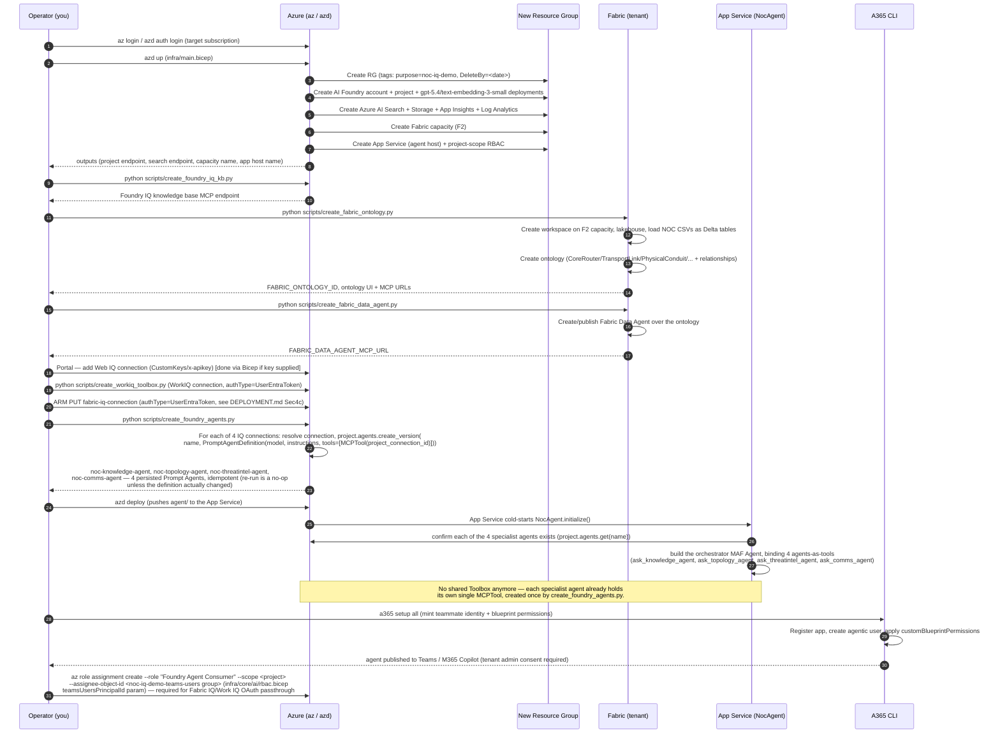
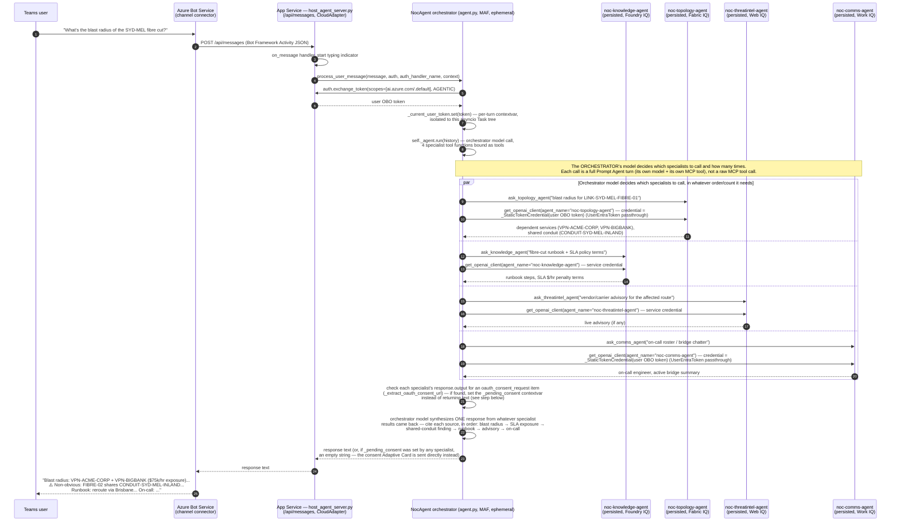

# Sequence Diagrams

## 1. End-to-end deployment sequence

## 2. Runtime turn — Teams user asks about the Sydney fibre cut

**Key point this diagram must make clear**: there are **four persisted Foundry
Prompt Agents**, each with its own single MCP tool baked into its own
definition, called via **agents-as-tools** from one ephemeral MAF
orchestrator `Agent`. The `par` block above shows the orchestrator model's
own tool-selection deciding which (and how many) specialists to invoke;
`agent.py` still does not iterate over the 4 IQ surfaces or hand-aggregate
their results itself — only the granularity of what's being routed to has
changed, from a raw MCP tool call to a whole persisted-agent turn.

## 3. The 5 narrative beats this sequence must produce

A correct end-to-end run must surface all five, each traceable to a real
tool call (verified via App Insights traces in the `verify-e2e` step, not
asserted from the model's unaided knowledge):

1. **Blast radius** — `VPN-ACME-CORP` + `VPN-BIGBANK` depend on the cut link
   (Fabric IQ).
2. **SLA exposure** — `$75,000/hr` = ACME (GOLD, `$50k/hr`) + BigBank (SILVER,
   `$25k/hr`) (Foundry IQ — SLA policy docs / Fabric IQ — SLA policy entity).
3. **Bounded exclusion** — `OzMine` (GOLD, `$40k/hr`) is **not** affected;
   the blast radius must be shown as bounded, not maximal (Fabric IQ).
4. **Non-obvious finding** — `LINK-SYD-MEL-FIBRE-02` (the "backup") shares
   `CONDUIT-SYD-MEL-INLAND` with the cut primary link — fake redundancy
   (Fabric IQ `RIDES_ON` relationship).
5. **Reroute** — the runbook-prescribed mitigation is a reroute via Brisbane
   (Foundry IQ knowledge base).

## 5. Merged end-to-end: the live Teams turn + TokenOps governance + the async gateway loop

Sections 2 and 3 above are two separate mermaid diagrams over the *same*
turn — this section interleaves them into one flat, numbered record, then
appends the two asynchronous flows (config-sync-worker's job cycle, and the
Admin UI's write path) that are not part of any single Teams turn but
directly feed and are fed by it. Recorded here for reference; not itself a
new diagram.

### Part 1 — the live Teams turn (steps 1-37)

| # | Description | Azure component |
|---|---|---|
| 1 | Teams user asks: "What's the blast radius of the SYD-MEL fibre cut?" | Microsoft Teams |
| 2 | Bot Service POSTs the Activity to `/api/messages` | Azure Bot Service |
| 3 | `on_message` handler fires, starts typing indicator | App Service |
| 4 | App Service calls `process_user_message(...)` on the orchestrator | App Service |
| 5 | Orchestrator requests the caller's OBO token (`ai.azure.com/.default`, AGENTIC) | A365 auth handler |
| 6 | OBO token returned, stashed in a per-turn contextvar | App Service → orchestrator |
| 7 | Orchestrator sends `POST /v1/precall` for its own model call | APIM `/ledger` → Run Ledger Container App |
| 8 | Run ledger returns `{allow\|mutate\|queue\|halt, reservation_id}` | Run Ledger + Cosmos DB (budget state) |
| 9 | *(if halted)* raises `_RunHaltedError` → "Run paused" card sent to Teams | App Service |
| 10 | *(if allowed)* orchestrator runs its model call, with all 5 specialist tools bound | Azure AI Foundry (`gpt-5.4`) |
| 11 | Orchestrator sends `POST /v1/postcall` with real usage for its own call | Run Ledger |
| 12 | Orchestrator's model decides which specialists to call — dispatches up to 5 in parallel | Foundry (tool selection) |
| 13 | `POST /v1/precall` for `noc-knowledge-agent` | Run Ledger |
| 14 | Calls `noc-knowledge-agent` (service credential) | Foundry Prompt Agent → Azure AI Search |
| 15 | Returns runbook steps + SLA terms; `POST /v1/postcall` with real usage | Run Ledger |
| 16 | `POST /v1/precall` for `noc-topology-agent` | Run Ledger |
| 17 | Calls `noc-topology-agent` (user OBO credential) | Foundry Prompt Agent → Fabric Data Agent → Lakehouse |
| 18 | Returns blast radius + shared-conduit finding; `POST /v1/postcall` | Run Ledger |
| 19 | `POST /v1/precall` for `noc-threatintel-agent` | Run Ledger |
| 20 | Calls `noc-threatintel-agent` (service credential) | Foundry Prompt Agent → Web IQ MCP |
| 21 | Returns any live advisory; `POST /v1/postcall` | Run Ledger |
| 22 | `POST /v1/precall` for `noc-comms-agent` | Run Ledger |
| 23 | Calls `noc-comms-agent` (user OBO credential) | Foundry Prompt Agent → Work IQ MCP → Teams/Outlook |
| 24 | Returns on-call + bridge chatter; `POST /v1/postcall` | Run Ledger |
| 25 | `POST /v1/precall` for `noc-incident-agent` | Run Ledger |
| 26 | Calls `noc-incident-agent` (user OBO credential) | Foundry Prompt Agent → Fabric RTI MCP → Eventhouse KQL DB |
| 27 | Returns alert timeline/optical evidence; `POST /v1/postcall` | Run Ledger |
| 28 | Orchestrator checks all specialist outputs for an `oauth_consent_request` (sets `_pending_consent` if found) | App Service |
| 29 | Orchestrator model synthesizes one answer, citing every source that responded | Foundry (`gpt-5.4`) |
| 30 | Returns response text (or empty string if a consent card takes its place) | App Service |
| 31 | App Service returns the response to Bot Service | App Service |
| 32 | Bot Service delivers the final answer to the Teams user | Microsoft Teams |
| 33 | Each specialist call also emits a structured `usage_event` log line, independent of the ledger calls above | Azure Monitor (App Insights) |
| 34-37 | *(governance side-effects, not user-visible)*: run ledger persists reservation/usage deltas against the run-scoped budget in Cosmos; `config-sync-worker`'s next cycle will read these updated numbers | Run Ledger + Cosmos DB |

Steps 13-27 (5 precall→call→postcall triplets) run in parallel — governed
identically whether the specialist authenticates as the service or via OBO
passthrough; only the transport of the *governed* call differs (direct to
Foundry either way), never the ledger accounting.

### Part 2 — asynchronous, out-of-band (not tied to any single Teams turn)

| # | Description | Azure component |
|---|---|---|
| 38 | Admin sets throttling / max-token quota for a consumer in the Admin UI SPA | Admin UI SPA (Container App) |
| 39 | SPA calls the FastAPI BFF, which `upsert_item`s the change into the Cosmos `config` container (per-consumer doc or `global`) | Admin UI BFF → Cosmos DB (data-plane RBAC: Contributor) |
| 40 | On its next scheduled tick, `config-sync-worker` job wakes up | Container Apps Job |
| 41 | Worker reads the `global` doc + all per-consumer config docs from Cosmos (self-bootstraps `global` on first run if missing) | Cosmos DB |
| 42 | Worker calls the Azure Retail Prices API and refreshes the `pricing` doc (per-model $/token) in Cosmos — fail-safe, never fails the job | Retail Prices API → Cosmos DB |
| 43 | Worker evaluates real usage (from App Insights/`usage_event` telemetry, aggregated) against each consumer's budget, deciding any model downgrades | Log Analytics / App Insights |
| 44 | Worker pushes the 4 allowed-model/quota named values, plus any downgrade decisions, into APIM | APIM named values |
| 45 | Next Teams turn's `/v1/precall` decisions (steps 8/13/16/19/22/25 above) now reflect the freshly-synced quotas/pricing | Run Ledger ↔ APIM named values ↔ Cosmos |
| 46 | Anyone running `check_usage.py`/`check_usage_detail.py` reads `usage_event` traces + the `pricing` doc to render real $ cost per turn | Log Analytics + Cosmos DB |

The loop that ties Part 1 and Part 2 together: every live Teams turn writes
usage into App Insights and ledger reservations into Cosmos; every worker
cycle reads that usage back out, refreshes pricing, and re-tightens the
named values the *next* turn's precall checks against. Cosmos is the
desired-state source of truth throughout; APIM named values are only the
runtime-enforced mirror.
