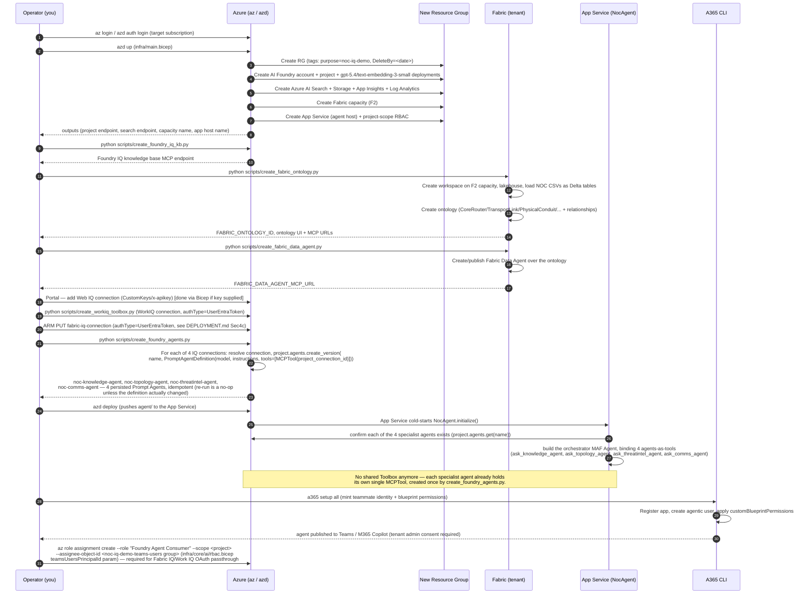
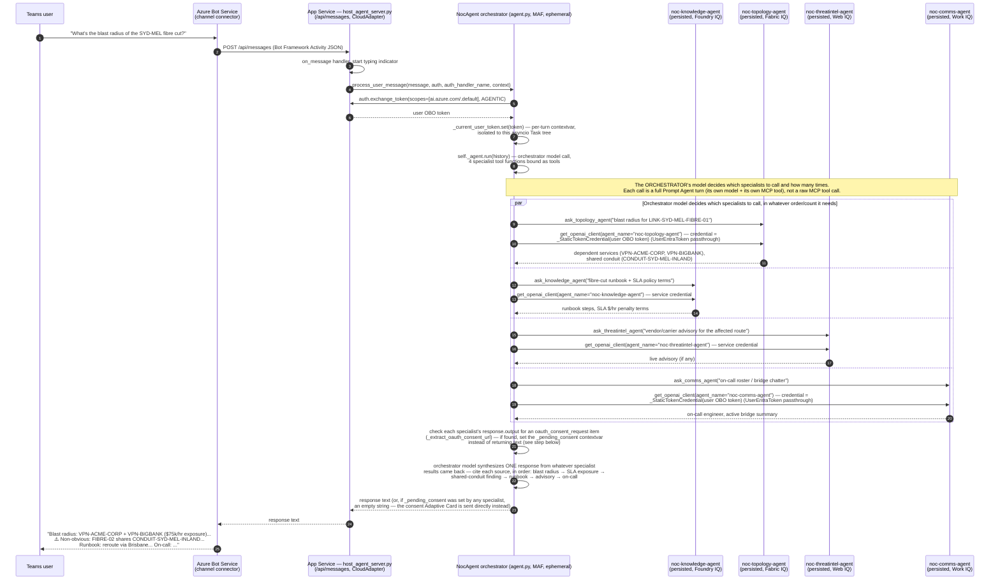
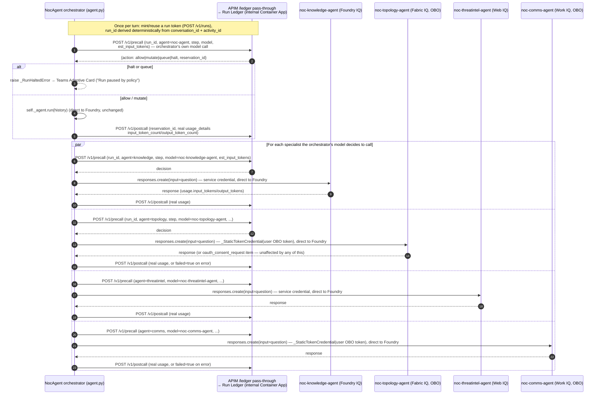

# Sequence Diagrams

## 1. End-to-end deployment sequence

## 2. Runtime turn — Teams user asks about the Sydney fibre cut

**Key point this diagram must make clear**: there are **four persisted Foundry
Prompt Agents**, each with its own single MCP tool baked into its own
definition, called via **agents-as-tools** from one ephemeral MAF
orchestrator `Agent`. The `par` block above shows the orchestrator model's
own tool-selection deciding which (and how many) specialists to invoke;
`agent.py` still does not iterate over the 4 IQ surfaces or hand-aggregate
their results itself — only the granularity of what's being routed to has
changed, from a raw MCP tool call to a whole persisted-agent turn.

## 3. Run-scoped token governance (TokenOps) — mixed routing, not a blanket APIM hop

**Why not simply route all 5 model calls (orchestrator + 4 specialists) through
APIM?** Two hard blockers, both discovered while wiring this up:

- **OAuth identity passthrough breaks.** `fabric_iq` and `work_iq` authenticate
  each `responses.create()` call as the *calling Teams user* (a
  `_StaticTokenCredential` wrapping their OBO token), so Agent Service attributes
  the stored per-user consent grant correctly. APIM's `authentication-managed-identity`
  policy substitutes **its own** identity before the call reaches Foundry —
  fine for the 2 service-identity specialists, but it would silently break
  consent attribution for these 2.
- **Persisted-agent request bodies don't fit the gateway's assumptions.**
  `openai-gateway`/`foundry-gateway`'s policies parse a `model` field and a
  `messages`/`input` field out of the request body for token estimation and
  the allowed-model check. A persisted Prompt Agent's model is baked into its
  *own* definition — the client-side `responses.create(input=question)` call
  often carries neither a `model` field nor a `messages` array, so those
  policies' assumptions (now fixed for Responses-API field names, see below)
  still don't fully describe what this app actually sends per specialist.

**What actually ships**: the orchestrator and all 4 specialists keep calling
Foundry **directly** (unchanged data path, so consent passthrough keeps
working for all 4 uniformly). Token governance is achieved by having
`agent.py` itself call the run ledger's `/v1/precall` and `/v1/postcall`
directly — the same decision contract (`allow` / `mutate` / `queue` / `halt`)
APIM's own policies use, just invoked from Python instead of from policy XML,
using the real `response.usage` each call already returns. Since the run
ledger's Container App has **internal-only ingress** (unreachable from the
non-VNet-integrated App Service), these calls go through a thin `/ledger`
pass-through API added to APIM (`run-ledger-gateway` in `apim.bicep`) — APIM
is already VNet-injected and can reach it; this is a plain reverse-proxy hop
with no body inspection, so it doesn't inherit either blocker above.

The deployed `openai-gateway`/`foundry-gateway` APIs (now fixed for
Responses-API field names: `input`/`max_output_tokens`/`input_tokens`/
`output_tokens`, with defensive fallback to the old Chat-Completions field
names) remain live and available for any *other* direct AOAI/Foundry caller
that does send REST-shaped, model-in-body traffic — they are just not in this
app's own hot path.

**Answering "how is fabric_iq/work_iq's usage governed if it never goes through
APIM?"**: identically to the other two, via this direct precall/postcall pair —
the OAuth-passthrough identity used for the Foundry call is completely
orthogonal to which channel reports the resulting token usage to the ledger.
The run ledger enforces the same run-scoped budget/halt/steer decisions either
way; only the transport of the *governed* call itself (direct vs. through
APIM) differs, and that choice is driven purely by which of the two blockers
above applies to that specialist.

## 4. The 5 narrative beats this sequence must produce

A correct end-to-end run must surface all five, each traceable to a real
tool call (verified via App Insights traces in the `verify-e2e` step, not
asserted from the model's unaided knowledge):

1. **Blast radius** — `VPN-ACME-CORP` + `VPN-BIGBANK` depend on the cut link
   (Fabric IQ).
2. **SLA exposure** — `$75,000/hr` = ACME (GOLD, `$50k/hr`) + BigBank (SILVER,
   `$25k/hr`) (Foundry IQ — SLA policy docs / Fabric IQ — SLA policy entity).
3. **Bounded exclusion** — `OzMine` (GOLD, `$40k/hr`) is **not** affected;
   the blast radius must be shown as bounded, not maximal (Fabric IQ).
4. **Non-obvious finding** — `LINK-SYD-MEL-FIBRE-02` (the "backup") shares
   `CONDUIT-SYD-MEL-INLAND` with the cut primary link — fake redundancy
   (Fabric IQ `RIDES_ON` relationship).
5. **Reroute** — the runbook-prescribed mitigation is a reroute via Brisbane
   (Foundry IQ knowledge base).
